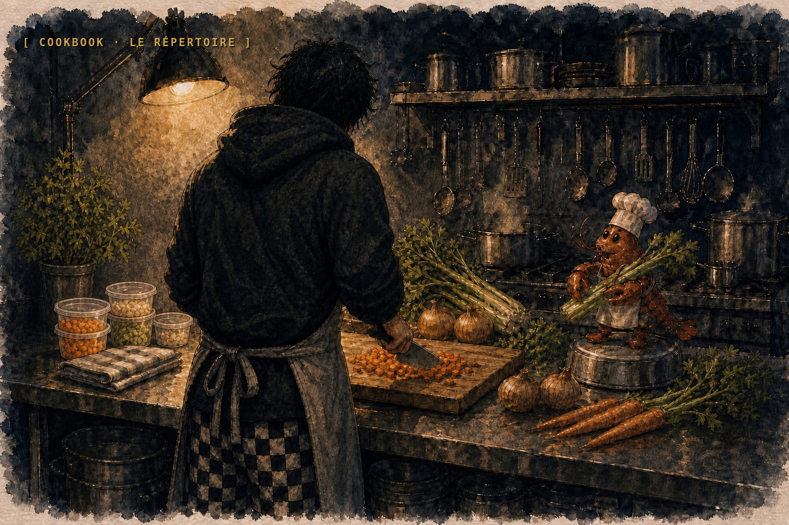
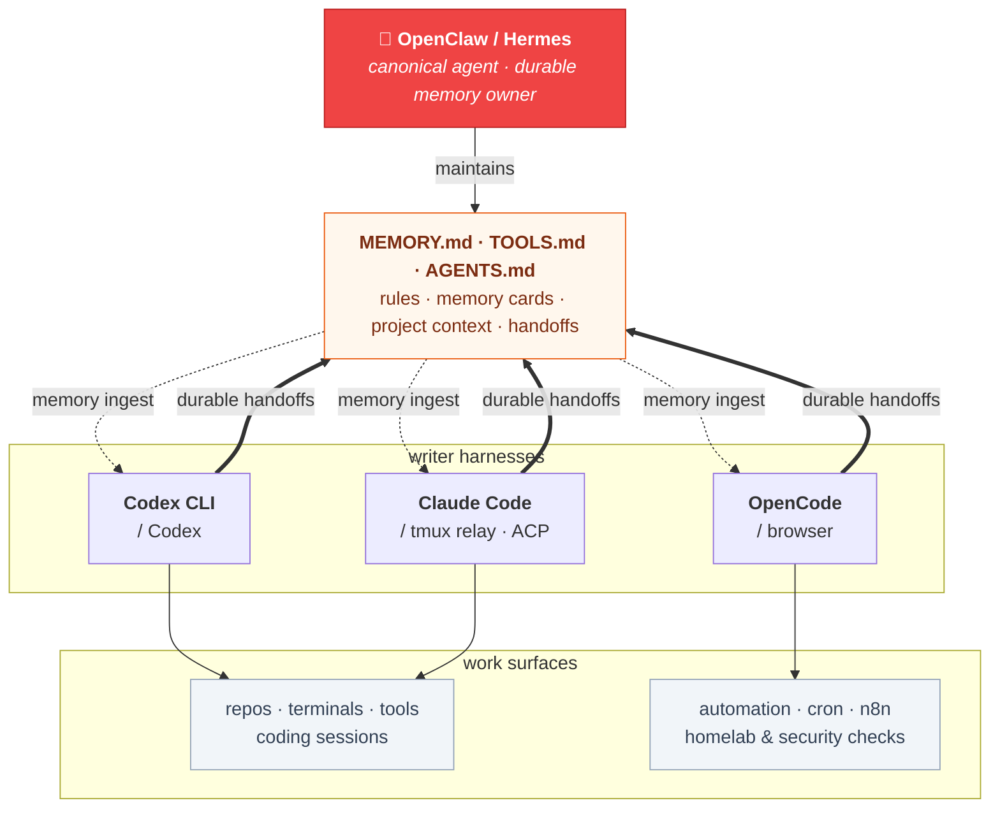

<p align="center">
  
</p>

<h1 align="center">🦞 Solomon's Guide to Cookin' with Gas</h1>

<p align="center">
  <strong>Keep your always-on agent aware of the work you do across every coding harness.</strong>
</p>

<p align="center">
  <em>Opinionated. Dogfooded. Broken-and-fixed in production. Tested in service.</em>
</p>

<p align="center">
  
  
  
  
  
  
</p>

<p align="center">
  🦞 No fluff. No theory without implementation. Every guide documents what was actually deployed, how to verify it, and what broke along the way.
</p>

## What this is

This is a working cookbook for engineers who run a long-lived agent in [OpenClaw](https://github.com/openclaw/openclaw), [Hermes Agent](https://github.com/NousResearch/hermes-agent), or a similar orchestrator, while also coding every day in tools like Codex CLI, Claude Code, OpenCode, and browser-native model sessions.

The cookbook is the documentation home of [Escoffier Labs](https://github.com/escoffier-labs), the org behind [Brigade](https://github.com/escoffier-labs/brigade) and its companion tools. The stack documented here is where those tools were extracted from.

The problem it solves is continuity. Your coding harnesses see one repo and one task at a time. Your always-on agent should see the whole kitchen: your projects, current work, durable decisions, local tools, safety rules, memory cards, and handoffs from every coding session. This cookbook documents the patterns that keep `MEMORY.md`, `TOOLS.md`, `AGENTS.md`, `CLAUDE.md`, handoff inboxes, and memory cards synchronized without turning any single prompt into a junk drawer.

In this stack, OpenClaw is the tested reference memory owner. Hermes can play the same role. Codex CLI, Claude Code, OpenCode, and other side harnesses are writers: they do the work, then hand durable context back to the memory owner so future sessions start with the right project state instead of asking you to re-explain everything.

It is **not** a framework, not a product, not a tutorial series. It is a record of what is actually deployed, why each piece is shaped the way it is, and what broke along the way. Lift any single piece. Adopt the whole thing. Or use it as a counterexample. All three are valid.

The infrastructure examples come from a single-engineer bare-metal Linux setup with a homelab behind it for self-hosting, security tooling, and knowledge management. The agent-memory pattern generalizes: one canonical memory owner, many coding harnesses, one shared contract for what gets remembered.

> The starter layout documented here was extracted into an installable CLI: [**Brigade**](https://github.com/escoffier-labs/brigade) (`pipx install brigade-cli`). If you want the kitchen without reading every recipe first, start there. The cookbook explains the why, Brigade gives you the setup.
>
> [](https://github.com/escoffier-labs/brigade)

Every recipe is free to read here and on the site. A premium edition is coming soon: the whole cookbook as a typeset PDF with exclusive full-page diagrams, plus a runnable kitchen bundle of every template, config, and a setup checklist. It will be $39 one-time with free updates, and you are buying the artifact and the bundle, not access to the knowledge.

## Who this is for

Use this cookbook if you want:

- an OpenClaw or Hermes agent that knows what changed across your repos, not just what happened in its own chat window
- Codex CLI, Claude Code, OpenCode, and similar tools to write durable handoffs instead of creating isolated session memories
- `MEMORY.md`, `TOOLS.md`, `AGENTS.md`, safety rules, and project context to stay maintained by the agent workflow, not by manual copy/paste
- local-first automation, security checks, content scrubbing, backups, and memory care around an agent that can actually touch your systems
- an installable starter layout via [Brigade](https://github.com/escoffier-labs/brigade), with the cookbook as the explanation layer

## The stack at a glance



## Recommended Provider Stack

The guides assume a specific provider mix. You can substitute, but if you want a known-good baseline:

- **The $200 stack is the normal recommendation.** Use Codex Pro as the main agent + coder lane when your OpenClaw agent is active every day, doing cron work, repo work, and second-pass review. One flat subscription covers the hot path, and Codex OAuth slots cleanly into OpenClaw's primary-model path.
- **A $100-ish stack can work if usage is conservative.** If your agent is not busy, you are not sharing the subscription with heavy coding sessions, and most background work stays on local/Ollama/browser lanes, you can run a smaller setup. Expect to manage rate limits more actively.
- **Claude Opus via Claude Code: escalation only.** Intel, design, architecture review, and second-opinion code review. Prefer the Claude Code tmux relay for interactive first-party harness work; keep ACPX for setups that explicitly need ACP. Do not call `claude -p` from OpenClaw automation.
- **Ollama (free): embeddings, commit messages, triage.** Local, fast, no round-trip.

### Claude Code via tmux: the June 2026 lesson

The Claude lesson has its own guide now: [Claude Code via tmux Relay](ai-stack/claude-code-tmux-relay.md).

The short version: keep Claude Code in its first-party interactive harness and let OpenClaw or Codex drive it through tmux. Use `tmux send-keys`, `tmux paste-buffer`, and `tmux capture-pane`; do not automate review with `claude -p`.

Two things changed the guidance:

1. In April 2026, direct Claude subscription OAuth through third-party harnesses stopped being a reliable OpenClaw backend.
2. By the June 2026 notes, `claude -p` / print-mode automation was drawing from Claude's separate **Usage** bucket. Print-mode automation is not the same budget surface as an interactive Claude Code session.

ACPX remains documented as a compatibility path when you need an ACP endpoint. For ordinary second-opinion code review, use the tmux relay. See [Claude Code via tmux Relay](ai-stack/claude-code-tmux-relay.md) for OpenClaw/Codex commands and [claude-cli → ACP Migration](ai-stack/claude-cli-to-acp-migration.md) for the ACPX compatibility runbook.

## Quick start

There is nothing to install for the cookbook itself - it is a collection of standalone guides. Pick the one that solves a problem you have right now:

- **[automation/cron-patterns.md](automation/cron-patterns.md)**: decide which layer (systemd, agent cron, n8n) each scheduled task in your stack actually belongs in
- **[ai-stack/multi-model-orchestration.md](ai-stack/multi-model-orchestration.md)**: wire one orchestrator across many models with the right model per task
- **[security/linux-hardening.md](security/linux-hardening.md)**: UFW, SSH hardening, fail2ban, and defense in depth for the host
- **[infrastructure/backup-recovery.md](infrastructure/backup-recovery.md)**: restic to NAS (twice daily) + cloud (weekly), Drive quota gotchas, KeePass canonical sync, snapshot mounts

### If you're here for the memory system

Read these in order:

1. **[knowledge/memory-token-optimization.md](knowledge/memory-token-optimization.md)**: the three-tier layout, local embeddings, and why the index stays tiny
2. **[knowledge/memory-architecture.md](knowledge/memory-architecture.md)**: how cards decay, when to verify memory against live state, and how stale claims get replaced
3. **[ai-stack/self-improving-agents.md](ai-stack/self-improving-agents.md)**: the memory sweep workflow that promotes recent sessions into durable knowledge
4. **[knowledge/claude-code-memory-handoffs.md](knowledge/claude-code-memory-handoffs.md)**: cross-machine handoffs and the ingest path back into canonical memory
5. **[automation/openclaw-cron-deep-dive.md](automation/openclaw-cron-deep-dive.md)**: scheduling patterns for sweep jobs, decay scans, and quiet-hour-safe maintenance

### If you want the installable version

The cookbook is the long-form guide. **[Brigade](https://github.com/escoffier-labs/brigade)** is the installable starter kit that turns the patterns here into a working agent kitchen: shared bootstrap files, per-harness handoff inboxes, memory ownership rules, content guards, a multi-agent orchestrator, an agent-facing daily driver, and local work loops.

```bash
pipx install brigade-cli
brigade init --target ~/agent-kitchen --depth workspace --harnesses claude,codex,openclaw
brigade doctor --target ~/agent-kitchen
```

It lays down sanitized bootstrap files, per-writer memory handoff inboxes, a conservative ingester, content-guard publish gates, a bounded `brigade run` orchestrator, a `brigade daily` driver, and a `brigade work` loop for dogfooding trusted repos. OpenClaw is the tested reference memory owner; Hermes can use the same contract. Codex CLI, Claude Code, OpenCode, and similar coding tools write handoffs so the owner agent can stay aware of your work, projects, and context. Adopt the cookbook patterns piecemeal here, or let `brigade` set up the whole shape and read the cookbook to understand why each piece is the way it is.

## Guides

### AI agent stack

| Guide | Description | Platform |
|-------|-------------|----------|
| [Multi-Model Orchestration](ai-stack/multi-model-orchestration.md) | Run GPT 5.5, Claude Code review, browser-LLM skills, and Ollama in one setup with the right model per task | Any |
| [claude-cli → ACP Migration](ai-stack/claude-cli-to-acp-migration.md) | Move Opus off the main-agent slot after Anthropic's April 2026 subscription-OAuth block | Anthropic |
| [Claude Code via ACP](ai-stack/acp-claude-code.md) | Running Claude Code as an ACP-driven compatibility lane after Anthropic's April 2026 harness block | Any |
| [Claude Code via tmux Relay](ai-stack/claude-code-tmux-relay.md) | Drive first-party Claude Code from OpenClaw through tmux for second-opinion review without `claude -p` | Any |
| [Sub-Agent Patterns](ai-stack/sub-agent-patterns.md) | Spawn patterns, model assignment, ACP escalation, error handling, and the wrapper script | Any |
| [GPT 5.5 Orchestration](ai-stack/gpt-55-orchestration.md) | Tool-call narration guard, strict-agentic detection gaps, silent-tool-loop triage, action-verb tuning | Any |
| [Self-Improving Agents](ai-stack/self-improving-agents.md) | Correction capture, behavioral-guard plugins (tool-narration-guard, tokenjuice), memory sweeps, and promotion rules | Any |
| [Session Management](ai-stack/session-management.md) | Why single-chat apps bottleneck your agent, Discord channel layouts, cron isolation, and the hybrid approach | Any |
| [Skills Development](ai-stack/skills-development.md) | Write custom skills, structure for discoverability, real-world examples, and skill management | Any |
| [Prompt Caching](ai-stack/prompt-caching.md) | Cache hygiene across Anthropic and OpenAI, so you avoid silent cost/quota leaks | Any |
| [Compaction & Context Tuning](ai-stack/compaction-and-context-tuning.md) | Compaction, memory flush, context pruning, and session search for long-running agents | Any |
| [Browser LLM Stack](ai-stack/browser-llm-stack.md) | Chromium lanes, persistent login profiles, noVNC inspection, and flock-locked browser-native model workflows | Any |
| [Local LLM Fallback](ai-stack/local-llm-fallback.md) | Ollama lanes for embeddings, commit drafts, cron triage, and bounded utility work without degrading the main chain | Any |
| [OAuth & Token Lifecycle](ai-stack/oauth-token-lifecycle.md) | Subscription OAuth across providers: rotating-token reuse, multi-file sync, api-key fallback shadowing, and the 402 red herring | Any |
| [Model Retirement & Fallbacks](ai-stack/model-retirement-and-fallbacks.md) | Where model ids hide, the cron-and-agent sweep to run on every retirement, and fallback chains that fail somewhere sane | Any |

### Automation

| Guide | Description | Platform |
|-------|-------------|----------|
| [Cron Patterns](automation/cron-patterns.md) | The three-layer cron stack: systemd timers vs agent cron vs n8n schedule triggers, where each scheduled task belongs | Any |
| [OpenClaw Cron Deep-Dive](automation/openclaw-cron-deep-dive.md) | Heartbeat batching, thinking-budget aliases, explicit delivery routing, quiet hours, and real-incident gotchas | OpenClaw |
| [Multi-Channel Setup](automation/multi-channel-setup.md) | Discord, Telegram, Signal routing, session isolation, ACP threads, and access control | Any |
| [Hooks](automation/hooks.md) | Three-layer hook model: boundary (git pre-push, outbound-scrub CLIs), tool-call (PreToolUse/PostToolUse, OpenClaw `before_tool_call`/`tool_result_persist`), lifecycle (SessionStart, `before_prompt_build`, `message_sending`) | Any |
| [n8n Patterns](automation/n8n-patterns.md) | Three interfaces (n8n-ops-mcp, REST API, direct sqlite), Code node sandbox + task-runner constant-folding trap, failure-classifier topology | n8n |
| [Social Publishing Stack](automation/social-publishing-stack.md) | Self-hosted Postiz + n8n publishing plumbing in one container, agent-driven over MCP with env-gated writes, the rate-limit guard, per-network token expiry. The pipes, not the content | n8n |
| [Sandbox Shims](automation/sandbox-shims.md) | PATH wrappers for read-only git, denied network tools, package-manager controls, and restricted worker lanes | Any |
| [Failure Classifier](automation/failure-classifier.md) | One n8n error workflow for the whole fleet: bucket taxonomy, fingerprint dedup, escalation routing, taxonomy tuning | n8n |

### Infrastructure

| Guide | Description | Platform |
|-------|-------------|----------|
| [Backup & Recovery](infrastructure/backup-recovery.md) | Restic to NAS (twice daily) + Google Drive (weekly), Drive quota/over-sync gotchas, KeePass canonical sync, snapshot mounts, disaster recovery | Any |
| [Upgrade Hygiene](infrastructure/upgrade-hygiene.md) | Surviving `openclaw update`: systemd regeneration, dist patches, OAuth sync, schema drift | Any |
| [OpenClaw Host Topology](infrastructure/openclaw-host-topology.md) | Audit the production host shape: services, config, agents, plugins, cron, memory, browser automation, and health checks | OpenClaw |
| [Homelab Topology](infrastructure/homelab-topology.md) | The hypervisor map: LXC vs VM split, container inventory, resource allocation on a small box, backup wiring | Proxmox |
| [Service Isolation](infrastructure/service-isolation.md) | One service per unprivileged container: blast-radius thinking, resource caps, ephemeral build containers, when a VM is justified | Proxmox |
| [Proxmox Agent Lab](infrastructure/proxmox-agent-lab.md) | Proxmox as the agent-stack substrate: service vs ephemeral CTs, the RAM budget, PBS backups, safe agent control via proxmox-mcp, proxguard CIS audits | Proxmox |
| [AdGuard DNS Sinkhole](infrastructure/adguard-dns-sinkhole.md) | Network DNS sinkhole on a home lab with a synced standby, managed by an agent through adguard-mcp tiers | Any |
| [NAS & Network Mounts](infrastructure/nas-and-backups.md) | CIFS automount that never hangs boot, soft mounts, guest vs credential auth, bind-mount traps, PBS-on-NAS resilience | Any |
| [Desktop Integration](infrastructure/desktop-integration.md) | The daily-driver desktop as a peer: SSH into Windows, SMB shares both ways, an SCP inbox, remote OBS control | Windows 11 + Linux |

### Knowledge management

| Guide | Description | Platform |
|-------|-------------|----------|
| [Memory & Token Optimization](knowledge/memory-token-optimization.md) | Three-tier memory architecture, local embedding search, memory sweep cadence, and 50-100x token reduction | Any |
| [Claude Code and Codex Memory Handoffs](knowledge/claude-code-memory-handoffs.md) | Cross-machine sync format and scheduled ingest path that keeps OpenClaw the canonical memory owner | Any |
| [Memory Architecture](knowledge/memory-architecture.md) | Operating model: memory as point-in-time claims, trust hierarchy, write/verify/decay loops, and stale-card handling | Any |
| [Bootstrap Files](knowledge/bootstrap-files.md) | What each durable agent file owns: AGENTS, CLAUDE, SOUL, USER, TOOLS, MEMORY, and safety files | Any |
| [Obsidian Sync Without Conflict Roulette](knowledge/obsidian-sync.md) | One canonical vault, one sync layer, and strict writer rules for bidirectional sync that stays boring | Any |
| [Session JSONL as Memory Source, Not Noise](knowledge/session-jsonl.md) | Search transcript logs for evidence, then promote only durable facts into memory | OpenClaw |
| [The MiseLedger Evidence Pipeline](knowledge/evidence-pipeline.md) | StationTrail and SourceHarvest export local history into one adapter contract; MiseLedger imports it into a searchable SQLite evidence archive with FTS and untrusted-context evidence bundles | Any |

### Security

| Guide | Description | Platform |
|-------|-------------|----------|
| [Linux Hardening](security/linux-hardening.md) | UFW, SSH hardening, fail2ban, service binding, and defense-in-depth for an OpenClaw host | Ubuntu 24.04 |
| [WSL2 Hardening](security/wsl-hardening.md) | Windows Firewall, RDP/SSH/SMB lockdown, port proxy hygiene, sleep prevention, and dual-OS defense | Windows 11 + WSL2 |
| [Agent Security](security/agent-security-hardening.md) | API gateway isolation, RBAC, sandboxing, circuit breakers, and a real post-mortem from a sub-agent nuking a database | Any |
| [Secret Management](security/secret-management.md) | Env files, systemd `EnvironmentFile`, browser profiles, rotation, and keeping secrets out of repos and memory | Any |
| [Agent Incident Runbook](security/incident-runbook.md) | Freeze automation, preserve evidence, rotate or restore, and turn agent failures into durable controls | Any |
| [Wazuh Triage](security/wazuh-triage.md) | RCA first, fix second, narrowest suppression last: keeping a self-hosted SIEM high-signal on an agent host | Wazuh |
| [MCP Incident Response](security/mcp-incident-response.md) | The agent-driven SOC loop: Wazuh alert to TheHive case to Cortex analysis to MISP enrichment to ATT&CK mapping, all over your own MCP servers | Any |

### Publishing

| Guide | Description | Platform |
|-------|-------------|----------|
| [Publish-Time Scrubbing](publishing/publish-time-scrubbing.md) | Deterministic scrubbers, scanner gates, media review, and publish logs before artifacts leave the private workspace | Any |

### Hardware

| Guide | Description | Platform |
|-------|-------------|----------|
| [Bare-Metal Setup](hardware/bare-metal-setup.md) | Hardware spec, OS install, baseline tuning for a single-host agent stack | Ubuntu 24.04 |
| [Disk Layout with LVM](hardware/disk-layout-lvm.md) | Two-disk LVM design that survives "I need to grow this" without a reinstall | Any |
| [Kernel Tuning](hardware/kernel-tuning.md) | sysctl, swap, scheduler choices, per-user limits for an always-on AI host | Linux 6.x |

### Tools

| Guide | Description | Platform |
|-------|-------------|----------|
| [MCP Catalog](tools/mcp-catalog.md) | Every MCP server published from this stack, what each one wraps, who uses it | Any |
| [Brigade](tools/brigade.md) | Installable agent workspace bootstrap, a multi-agent orchestrator, per-writer handoffs, an agent-facing daily driver, scanners, and local publish gates | Any |
| [Skillet](tools/skillet.md) | Installable agent skills: line-check repo audits with leverage-sorted backlogs, bug-hunt, security-sweep, publish gates, releases, handoffs | Any |
| [OpsDeck](tools/opsdeck.md) | Self-hosted ops dashboard, eight pages over the OpenClaw workspace, with auto-detected sidecar | Any |
| [Repo Redeploy](tools/repo-redeploy.md) | One cron job that watches your own MCP/CLI repos and redeploys them across hosts | Any |
| [MCP READMEs: All Five Clients](tools/mcp-readme-five-clients.md) | Every MCP repo ships setup blocks for Claude Desktop, Claude Code, OpenClaw, Hermes, Codex CLI | Any |

### Philosophy

| Essay | Description |
|-------|-------------|
| [Why One Host](philosophy/why-one-host.md) | The case for not distributing what one machine can do |
| [Why Dogfood Everything](philosophy/why-dogfood-everything.md) | Ship → use → break → fix → write it down, in that order |
| [What This Stack Is Not](philosophy/what-this-stack-is-not.md) | Hard nos: SaaS lock-in, k8s, microservices, untested fashion |
| [Manifesto vs Framework](philosophy/manifesto-vs-framework.md) | Why this is a cookbook and not a tool |

## Templates

Drop-in artifacts you can lift without adopting the whole thing. See [`templates/`](templates/).

| Template | Used by |
|----------|---------|
| [`templates/cron/`](templates/cron/) | systemd timer, agent cron, n8n schedule trigger skeletons, paired with [`automation/cron-patterns.md`](automation/cron-patterns.md) |
| [`templates/hooks/`](templates/hooks/) | git pre-push, Claude Code PostToolUse, OpenClaw sync plugin skeletons, paired with [`automation/hooks.md`](automation/hooks.md) |
| [`templates/bootstrap/`](templates/bootstrap/) | sanitized workspace file skeletons, paired with [`knowledge/bootstrap-files.md`](knowledge/bootstrap-files.md) |
| [`templates/skills/`](templates/skills/) | public-safe `SKILL.md` skeleton and sanitization checklist, paired with [`ai-stack/skills-development.md`](ai-stack/skills-development.md) |
| [`templates/ai-stack/`](templates/ai-stack/) | model alias snippets, Claude Code tmux relay, ACP wrapper shape, plugin smoke check, paired with [`ai-stack/multi-model-orchestration.md`](ai-stack/multi-model-orchestration.md) |
| [`templates/n8n/`](templates/n8n/) | workflow and failure-classifier skeletons, paired with [`automation/n8n-patterns.md`](automation/n8n-patterns.md) |
| [`templates/scrubbers/`](templates/scrubbers/) | deterministic publish-boundary scrubber skeleton and fixtures, paired with [`publishing/publish-time-scrubbing.md`](publishing/publish-time-scrubbing.md) and [`automation/hooks.md`](automation/hooks.md) |
| [`templates/sandbox/`](templates/sandbox/) | restricted worker command wrappers, paired with [`automation/sandbox-shims.md`](automation/sandbox-shims.md) and [`automation/hooks.md`](automation/hooks.md) |
| [`templates/security/`](templates/security/) | env-file and incident-note placeholders, paired with [`security/secret-management.md`](security/secret-management.md) and [`security/incident-runbook.md`](security/incident-runbook.md) |

## Skills

Public, sanitized skills copied from the real stack live in [`skills/`](skills/). These are reusable patterns, not private machine dumps.

## Guide format

Every guide follows the same skeleton. See [CONTRIBUTING.md](CONTRIBUTING.md) for the full template:

1. **What this is** and who it's for
2. **Why this way**: tradeoffs vs the obvious alternatives
3. **Prerequisites**
4. **Before / After**
5. **Implementation** with real commands
6. **Verification** commands you can run right now
7. **Gotchas** from real deployments
8. **Templates + Related** cross-links

Reference implementation: [`automation/cron-patterns.md`](automation/cron-patterns.md).

## Contributing

PRs welcome. See [CONTRIBUTING.md](CONTRIBUTING.md). Two non-obvious rules:

1. **No personal hostnames or IPs in committed text.** Use generic terms.
2. **Every guide ends with a Gotchas section.** If nothing broke, the guide is incomplete.

A pre-push hook ships at [`hooks/pre-push`](hooks/pre-push) that runs [content-guard](https://github.com/escoffier-labs/content-guard) over the working tree to catch leaks before they hit the remote. Activate after cloning:

```bash
git config core.hooksPath hooks
```

## Related projects

- [Brigade](https://github.com/escoffier-labs/brigade): the installable starter kit for synced agent memory, handoffs, and workspace bootstrap files
- [OpenClaw](https://github.com/openclaw/openclaw): the tested reference agent and memory owner for this stack
- [content-guard](https://github.com/escoffier-labs/content-guard): the policy-driven scanner used by the pre-push hook
- [ops-deck-oss](https://github.com/solomonneas/ops-deck-oss): self-hosted ops dashboard
- [n8n-ops-mcp](https://github.com/solomonneas/n8n-ops-mcp), [jellyfin-mcp](https://github.com/solomonneas/jellyfin-mcp), [mcporter](https://github.com/solomonneas/mcporter): MCPs from this stack
- [openclaw-overlay](https://github.com/solomonneas/openclaw-overlay): HUD overlay for session monitoring
- [usage-tracker](https://github.com/escoffier-labs/usage-tracker): token usage and cost analytics

## License

- Code, scripts, and templates: [MIT](LICENSE)
- Narrative content (guides, manifestos, prose): [CC BY-NC-ND 4.0](CONTENT-LICENSE) 🦞

> 🦞 *Built by an engineer who runs this stack 24/7 on bare metal and broke everything at least once so you don't have to.*
